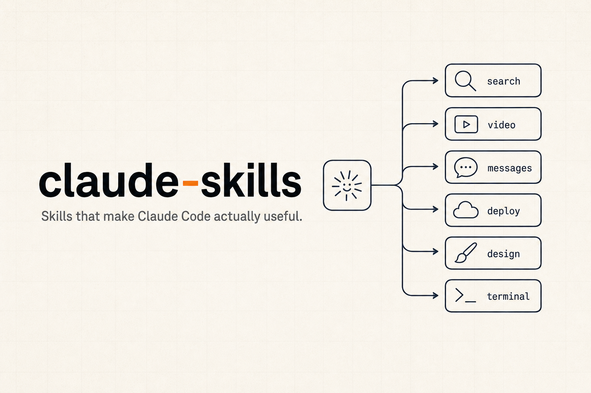

<p align="center">
  
</p>

**claude-skills** is a collection of [Claude Code](https://docs.claude.com/en/docs/claude-code) skills I've built and use every day — to search the web, mine Reddit, query analytics, ship Expo builds, write in my own voice, and keep my Mac clean. Install the whole set in one command, or add a single skill on its own.

```
/plugin marketplace add johnkueh/claude-skills
/plugin install claude-skills@johnkueh-skills
```

That's the full collection. Want just one? Every skill is its own plugin:

```
/plugin install icon-search@johnkueh-skills
/plugin install reddit-miner@johnkueh-skills
```

## Why skills

A skill teaches Claude Code a job you'd otherwise re-explain every session — which API to call, which flags matter, what the output should look like. Claude loads the right one on its own when your request matches, so "find me an icon for a vegetarian recipe" or "what are people asking about retatrutide on Reddit" just works, with the real tool behind it instead of a guess.

These are the ones that earned a permanent spot in my setup. They lean on real keys and CLIs (DataForSEO, Exa, Firecrawl, the YouTube API, `gcloud`), so most need a token or two — each skill's `SKILL.md` says exactly what.

## The skills

### Research & content

| Skill | What it does |
|---|---|
| [`exa`](skills/exa) | Search the web and scrape clean page text via the Exa API — neural and keyword search, pay per result. |
| [`reddit-miner`](skills/reddit-miner) | Pull posts, threads, and question clusters from Reddit through a headless browser that gets past the bot challenge. |
| [`keyword-data`](skills/keyword-data) | DataForSEO keyword research — search volume, intent, difficulty, CPC, and suggestions for content planning. |
| [`serp-data`](skills/serp-data) | Geo-targeted SERP analysis — who ranks where, content gaps, and features like featured snippets and PAA. |
| [`aeo-monitor`](skills/aeo-monitor) | Track which AI chatbots (ChatGPT, Perplexity, Google AI Overview, Claude) cite a project, and how that moves. |
| [`youtube-transcribe`](skills/youtube-transcribe) | Get a clean transcript from any YouTube video for research, fact-checking, or content. |
| [`notion-page`](skills/notion-page) | Read a Notion page from its URL and return the body as markdown. |

### Comms

| Skill | What it does |
|---|---|
| [`slack-search`](skills/slack-search) | Search Slack messages, pull a thread, or look someone up — across your channels and DMs. |
| [`wacli`](skills/wacli) | Read and send WhatsApp messages from the command line — search chats, list groups, grab a thread. |
| [`x-monitor`](skills/x-monitor) | Watch X profiles for new posts and get a daily digest of what they said. |

### Build & ship

| Skill | What it does |
|---|---|
| [`expo-local-build`](skills/expo-local-build) | Build an Expo app locally and send the IPA or APK straight to a phone over a Cloudflare tunnel. |
| [`cloudflare-tunnel-portless`](skills/cloudflare-tunnel-portless) | An ngrok replacement that puts many local dev servers behind one wildcard subdomain, with Metro switching for Expo worktrees. |
| [`ios-device`](skills/ios-device) | Drive a paired iPhone or iPad over the wireless tunnel — stream logs, pull files, trigger a memory warning, reboot. |
| [`vercel-logs`](skills/vercel-logs) | Query Vercel runtime and build logs to debug production, with full message bodies the dashboard truncates. |
| [`instantdb`](skills/instantdb) | Build a working React, vanilla JS, or Expo app with InstantDB as a realtime, local-first backend. |
| [`daily-digest`](skills/daily-digest) | A per-project morning roundup — new signups, top activity, API and LLM cost, and what changed — pulled from your own data. |

### Copy & design

| Skill | What it does |
|---|---|
| [`icon-search`](skills/icon-search) | Find the right icon across Lucide, Phosphor, Tabler, Heroicons, and HugeIcons by describing it, and get the exact React import back. |
| [`gpt-image-gen-2`](skills/gpt-image-gen-2) | Generate logos, illustrations, photoreal shots, UI mockups, and ads with GPT Image 2 — with cost logged per call. |
| [`veo-video-gen`](skills/veo-video-gen) | Generate cinematic videos with Veo 3.1 (text/image→video) — pairs with a GPT Image still, quotes exact per-second cost up front, true-loop + web MP4/WebM/poster output. |
| [`kole-design-tips`](skills/kole-design-tips) | A house UI/UX playbook for reviewing app and web screens — typography, spacing, dark mode, motion, the "looks AI-generated" smell test. |
| [`mailchimp-copy-style`](skills/mailchimp-copy-style) | A house copy guide for UI strings, errors, empty states, onboarding, and marketing — voice, tone, and microcopy. |
| [`julian-storytelling-tips`](skills/julian-storytelling-tips) | A house storytelling playbook for talks, pitches, launches, and long-form — strategic withholding, time dilation, hooks, and delivery, distilled from Julian Shapiro. |
| [`youtube-video-upload`](skills/youtube-video-upload) | Upload a finished video to YouTube through the Data API. |

### Voice

| Skill | What it does |
|---|---|
| [`johns-writing-style`](skills/johns-writing-style) | How I write in iMessage and WhatsApp, so a drafted reply sounds like me — derived from my own message history. |

### Mac hygiene

| Skill | What it does |
|---|---|
| [`system-disk-cleanup`](skills/system-disk-cleanup) | Find what's eating your disk and clear it safely. |
| [`system-memory-cleanup`](skills/system-memory-cleanup) | Spot CPU and memory hogs, and clean up orphaned processes. |

## Installing one skill vs. all of them

The `claude-skills` plugin ships every skill above. Each skill is also published as its own plugin, so you can take only what you need:

```
/plugin marketplace add johnkueh/claude-skills

/plugin install claude-skills@johnkueh-skills      # everything
/plugin install exa@johnkueh-skills                # just one
```

Use the skill name as the plugin name — `<name>@johnkueh-skills`. Both can coexist; they're alternatives, not a dependency.

Once a skill is installed, Claude Code loads it automatically when your request matches its triggers. You don't call it by name — just ask for the thing.

## How this repo is built

Each skill is a folder under `skills/<name>/` with a `SKILL.md` and whatever supporting files it needs. The marketplace manifest is generated, not hand-written:

```sh
bun scripts/build-marketplace.ts
```

This walks the committed skill folders, regenerates `.claude-plugin/marketplace.json` (the bundle plus one plugin per skill), and rebuilds the `plugins/` symlink tree each single-skill plugin points at. Add a skill folder, run it, and every install command stays in sync. Verify with:

```sh
claude plugin validate --strict .
```

## License

MIT.
